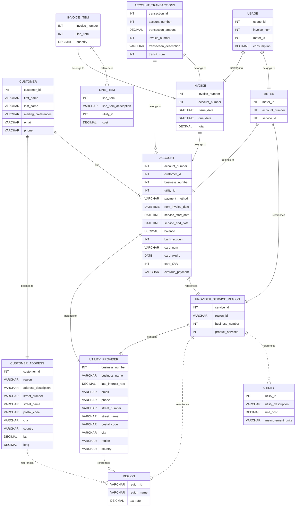

```mermaid
erDiagram
	CUSTOMER {
		INT customer_id
		VARCHAR first_name
		VARCHAR last_name
		VARCHAR mailing_preferences
		VARCHAR email
		VARCHAR phone
	}

	REGION {
		VARCHAR region_id
		VARCHAR region_name
		DEICMAL tax_rate
	}

	CUSTOMER_ADDRESS {
		INT customer_id
		VARCHAR region
		VARCHAR address_description
		VARCHAR street_number
		VARCHAR street_name
		VARCHAR postal_code
		VARCHAR city
		VARCHAR country
		DECIMAL lat
		DECIMAL long
	}


	UTILITY {
		INT utility_id
		VARCHAR utility_description
		DECIMAL unit_cost
		VARCHAR measurement_units
	}

	UTILITY_PROVIDER {
		INT business_number
		VARCHAR business_name
		DECIMAL late_interest_rate
		VARCHAR email
		VARCHAR phone
		VARCHAR street_number
		VARCHAR street_name
		VARCHAR postal_code
		VARCHAR city
		VARCHAR region
		VARCHAR country
	}

	PROVIDER_SERVICE_REGION {
		INT service_id
		VARCHAR region_id
		INT business_number
		INT product_serviced
	}


	ACCOUNT {
		INT account_number
		INT customer_id
		INT business_number
		INT utility_id
		VARCHAR payment_method
		DATETIME next_invoice_date
		DATETIME service_start_date
		DATETIME service_end_date
		DECIMAL balance
		INT bank_account
		VARCHAR card_num
		DATE card_expiry
		INT card_CVV
		VARCHAR overdue_payment
	}

	INVOICE {
		INT invoice_number
		INT account_number
		DATETIME issue_date
		DATETIME due_date
		DECIMAL total
	}

	LINE_ITEM {
		INT line_item
		VARCHAR line_item_description
		INT utility_id
		DECIMAL cost
	}

	INVOICE_ITEM {
		INT invoice_number
		INT line_item
		DECIMAL quantity
	}

	ACCOUNT_TRANSACTIONS {
		INT transaction_id
		INT account_number
		DECIMAL transaction_amount
		INT invoice_number
		VARCHAR transaction_description
		INT transit_num
	}

	METER {
		INT meter_id
		INT account_number
		INT service_id
	}

	USAGE {
		INT usage_id
		INT invoice_num
		INT meter_id
		DECIMAL consumption
	}

	CUSTOMER ||--|| CUSTOMER_ADDRESS : "belongs to"
	CUSTOMER_ADDRESS ||..o{ REGION : "references"
	
	UTILITY_PROVIDER ||..o{ REGION : "references"

	PROVIDER_SERVICE_REGION ||--|| UTILITY_PROVIDER : "contains"
	PROVIDER_SERVICE_REGION ||..o{ REGION : "references"
	PROVIDER_SERVICE_REGION ||..o{ UTILITY : "references"

	CUSTOMER ||--|{ ACCOUNT : "has"
	ACCOUNT ||--|| UTILITY_PROVIDER : "belongs to"
	ACCOUNT ||--|| PROVIDER_SERVICE_REGION : "references"

	INVOICE ||--|| ACCOUNT : "belongs to"

	INVOICE_ITEM ||--|| INVOICE : "belongs to"
	INVOICE_ITEM ||--o{ LINE_ITEM : "references"

	ACCOUNT_TRANSACTIONS ||--o{ ACCOUNT : "belongs to"
	ACCOUNT_TRANSACTIONS ||--|| INVOICE : "belongs to"

	METER ||--|| ACCOUNT : "belongs to"
	METER ||--|| PROVIDER_SERVICE_REGION : "references"

	USAGE ||--|| INVOICE : "belongs to"
	USAGE ||--|| METER : "belongs to"
```